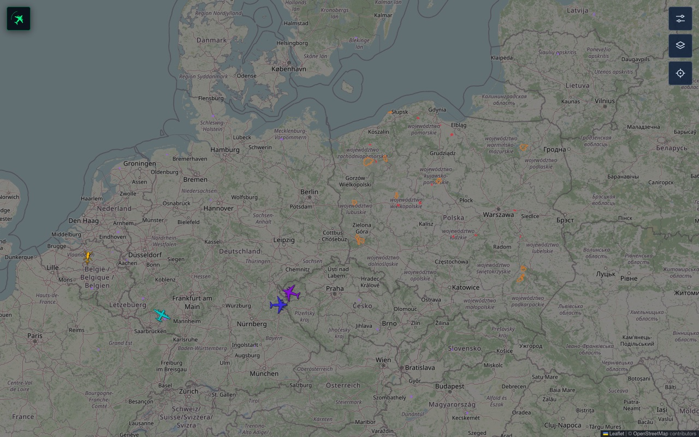
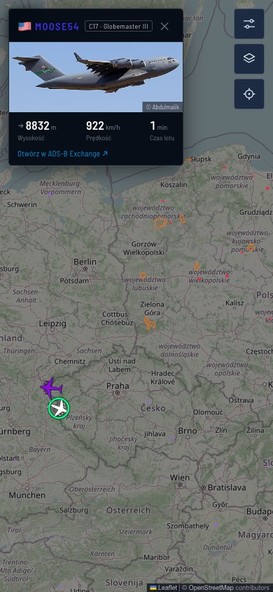
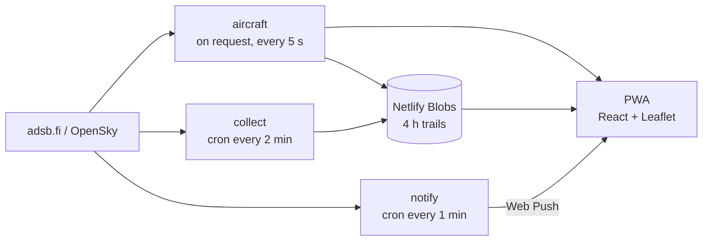

<div align="center">


# Military Radar

**Live military aircraft, emergency-service helicopters and the largest transports over Poland — with a push alert when one comes close to you.**

[**radar-wojskowy.netlify.app**](https://radar-wojskowy.netlify.app)


</div>

<p align="center">
  
  &nbsp;
  
</p>

> The app itself is in Polish.

## What it shows

| | |
|---|---|
| **Military** | aircraft tagged as military by adsb.fi, plus ones the app identifies itself — by ICAO address blocks, callsigns (RCH, SAVER, DUKE…) and squawks 7777 / 7400 |
| **Service helicopters** | air ambulance (LPR), police, border guard and foreign rescue services — confirmed rotorcraft only |
| **Heavy aircraft** | Boeing 747, An-124, An-225 |

Each category can be switched off — it then disappears from the map and stops sending alerts.

## Features

- **Live map** — refreshed every 5 s with smooth icon movement; 40+ silhouettes (fighters, tankers, transports, helicopters, drones) coloured by altitude
- **Aircraft card** — photo from Planespotters, type, country, altitude with climb/descent trend, speed, flight time and likely landing airfield
- **Flight trail** — up to 4 hours of history stored server-side, recorded even when nobody has the app open
- **Push notifications** — an alert when an aircraft enters a chosen radius around your position, even with the app closed (on iPhone after adding it to the home screen)
- **Inbound heavies** — Boeing 747s and An-124s whose flight plan says Rzeszów (EPRZ) or Kraków (EPKK): shown on the map hours before they reach Polish airspace, with destination, estimated landing time and time to go, plus a push alert; per-airport switches
- **Rare aircraft alerts** — tankers, AWACS, reconnaissance, bombers and surveillance drones anywhere over Poland, regardless of your position (one alert per aircraft per 12 h)
- **Overlays** — Polish military airfield grounds (red), major NATO bases (purple) and 12 military training areas (orange, hatched)
- **Airspace active now** — military zones (TSA, TRA, D, R) reserved for specific hours right now in the Polish airspace use plan (drone corridors and all-day blanket reservations are left out), with hours, altitudes, the reserving base and aircraft type (e.g. *TS7 · F-35 · Łask · 10:00–11:00*)
- **Airfield card** — tap a military airfield to see what is planned from it today in the PANSA plan (e.g. *F-35 · 10:00–12:10 · TS6, TS7*) and what is airborne within 50 km
- **Six base maps** — dark, classic, satellite, neutral dark, neutral light, terrain
- **PWA** — installs like a native app on phone and desktop

## Data sources

| Source | Used for |
|---|---|
| [adsb.fi](https://opendata.adsb.fi) `/v2/mil` | global list of military aircraft |
| [adsb.fi](https://opendata.adsb.fi) `/v2/lat/…/lon/…/dist/250` | all traffic over Poland — catches military aircraft that `/mil` does not tag |
| [OpenSky Network](https://opensky-network.org) | fallback when adsb.fi is down (no type or registration) |
| [Planespotters.net](https://www.planespotters.net) | aircraft photos |
| [OpenStreetMap](https://www.openstreetmap.org) | airfield and training-area outlines |
| [PANSA AUP/UUP](https://airspace.pansa.pl) | daily airspace use plan — which military zones are reserved, when and by whom (informative only) |
| [adsb.lol](https://api.adsb.lol) | global lookup by aircraft type — a 747 over the Atlantic is outside the app's usual area |
| [adsbdb](https://api.adsbdb.com) | flight routes by callsign — ADS-B itself carries no destination |

ADS-B does not carry a take-off time, so **flight time** counts from the earliest trail point the server knows — a lower bound, not an exact value.

## How it works



| Function | Role |
|---|---|
| `aircraft` | fetches and classifies traffic, returns the trail of a selected aircraft |
| `collect` | records trails in the background every 2 minutes |
| `notify` | checks every subscriber's radius each minute and sends push alerts |
| `airspace` | proxies and trims the PANSA airspace use plan (no CORS upstream), cached 10 min |
| `inbound` | serves 747s and An-124s bound for Rzeszów or Kraków |
| `inbound-collect` | refreshes that list every 10 minutes (adsb.lol + adsbdb) so page traffic never reaches those services |
| `subscribe` / `status` / `test-push` | subscription storage, diagnostics, test push |

## Running locally

```bash
npm install
npx netlify dev      # Vite + Netlify Functions
```

Plain `npm run dev` starts only the UI — the map stays empty and the status mark in the corner turns red.

Push notifications need VAPID keys (`npx web-push generate-vapid-keys`) — see [`.env.example`](.env.example).

```bash
npm test             # vitest
npm run lint         # eslint
npm run build        # production build to dist/
```

Deployment: every push to `main` is built automatically on Netlify.

## Project structure

```
netlify/functions/   aircraft, airspace, collect, notify, subscribe, status, test-push
  lib/               military classification, Poland boundary, security
src/
  components/        map, aircraft card, panels, SVG silhouettes
  data/              airfield and training-area outlines
  lib/               palette, geometry, type names, photo matching
  airfields.js       airfields: Polish military, civil, NATO bases
test/                vitest tests
```

## License

Code: [MIT](LICENSE) © 2026 Maciej Poręba.

Map data and the airfield and training-area outlines in `src/data/` come from © [OpenStreetMap](https://www.openstreetmap.org/copyright) contributors and are available under the [ODbL](https://opendatacommons.org/licenses/odbl/). Aircraft data belongs to adsb.fi and OpenSky Network, the airspace use plan to PANSA (Polska Agencja Żeglugi Powietrznej), photos to their authors on Planespotters.net — each under its own terms.
