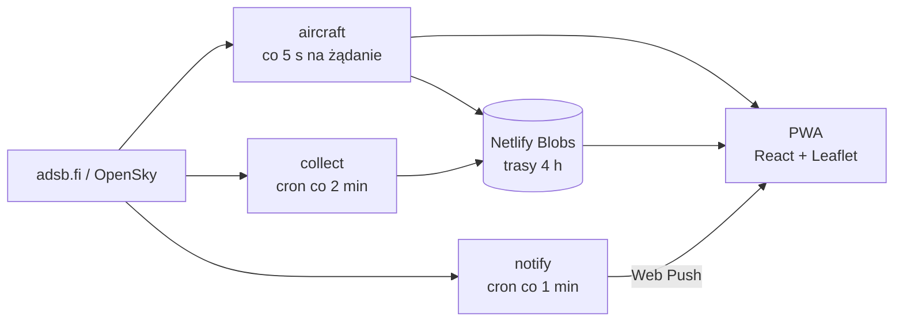

<div align="center">


# Radar Wojskowy

**Samoloty wojskowe, służbowe śmigłowce i największe transportowce nad Polską — na żywo, z powiadomieniem, gdy któryś pojawi się blisko Ciebie.**

[**radar-wojskowy.netlify.app**](https://radar-wojskowy.netlify.app)


</div>

<p align="center">
  
  &nbsp;
  
</p>

## Co pokazuje

| | |
|---|---|
| **Wojsko** | maszyny oznaczone jako wojskowe w adsb.fi oraz rozpoznane samodzielnie — po blokach adresów ICAO, znakach wywoławczych (RCH, SAVER, DUKE…) i squawkach 7777 / 7400 |
| **Śmigłowce służbowe** | LPR, Policja, Straż Graniczna i zagraniczne służby ratunkowe — tylko potwierdzone wiropłaty |
| **Duże samoloty** | Boeing 747, An-124, An-225 |

Każdą kategorię można wyłączyć — znika wtedy z mapy i przestaje wysyłać alerty.

## Funkcje

- **Mapa na żywo** — odświeżanie co 5 s, płynny ruch ikon, ponad 40 sylwetek (myśliwce, tankowce, transportowce, śmigłowce, drony) w kolorze pułapu
- **Karta maszyny** — zdjęcie z Planespotters, typ, kraj, wysokość z trendem, prędkość, czas lotu i przewidywane lotnisko lądowania
- **Trasa lotu** — do 4 godzin historii zapisywanej po stronie serwera, także gdy nikt nie ma otwartej aplikacji
- **Powiadomienia push** — alert, gdy maszyna wleci w wybrany promień od Twojej pozycji, nawet przy zamkniętej aplikacji (na iPhonie po dodaniu do ekranu głównego)
- **Warstwy** — teren polskich lotnisk wojskowych (czerwony), główne bazy NATO (fioletowy) i 12 poligonów (pomarańczowy, kreskowany)
- **Sześć podkładów** — ciemny, klasyczny, satelita, neutralne ciemny i jasny, teren
- **PWA** — instaluje się jak aplikacja, działa na telefonie i komputerze

## Skąd dane

| Źródło | Do czego |
|---|---|
| [adsb.fi](https://opendata.adsb.fi) `/v2/mil` | globalna lista maszyn wojskowych |
| [adsb.fi](https://opendata.adsb.fi) `/v2/lat/…/lon/…/dist/250` | cały ruch nad Polską — stąd wyłapywane są maszyny, których `/mil` nie oznacza |
| [OpenSky Network](https://opensky-network.org) | zapas, gdy adsb.fi nie odpowiada (bez typu i rejestracji) |
| [Planespotters.net](https://www.planespotters.net) | zdjęcia maszyn |
| [OpenStreetMap](https://www.openstreetmap.org) | obrysy lotnisk i poligonów (ODbL) |

ADS-B nie podaje godziny startu, więc **czas lotu** to czas od pierwszego punktu trasy, jaki zna serwer — dolna granica, nie dokładna wartość.

## Jak to działa



| Funkcja | Rola |
|---|---|
| `aircraft` | pobiera i klasyfikuje ruch, zwraca trasę wybranej maszyny |
| `collect` | co 2 minuty zapisuje trasy w tle |
| `notify` | co minutę sprawdza zasięg subskrybentów i wysyła push |
| `subscribe` / `status` / `test-push` | zapis subskrypcji, diagnostyka, testowy push |

## Uruchomienie lokalne

```bash
npm install
npx netlify dev      # Vite + Netlify Functions
```

Sam `npm run dev` uruchomi interfejs bez funkcji — mapa zostanie pusta, a znacznik w rogu zaświeci na czerwono.

Powiadomienia wymagają kluczy VAPID (`npx web-push generate-vapid-keys`) — wzór w [`.env.example`](.env.example).

```bash
npm test             # vitest
npm run lint         # eslint
npm run build        # produkcja do dist/
```

Wdrożenie: każdy push na `main` buduje się automatycznie na Netlify.

## Struktura

```
netlify/functions/   aircraft, collect, notify, subscribe, status, test-push
  lib/               klasyfikacja wojska, granice Polski, bezpieczeństwo
src/
  components/        mapa, karta maszyny, panele, sylwetki SVG
  data/              obrysy lotnisk i poligonów
  lib/               paleta, geometria, nazwy typów, dopasowanie zdjęć
  airfields.js       lotniska: polskie wojskowe, cywilne, bazy NATO
test/                testy vitest
```
